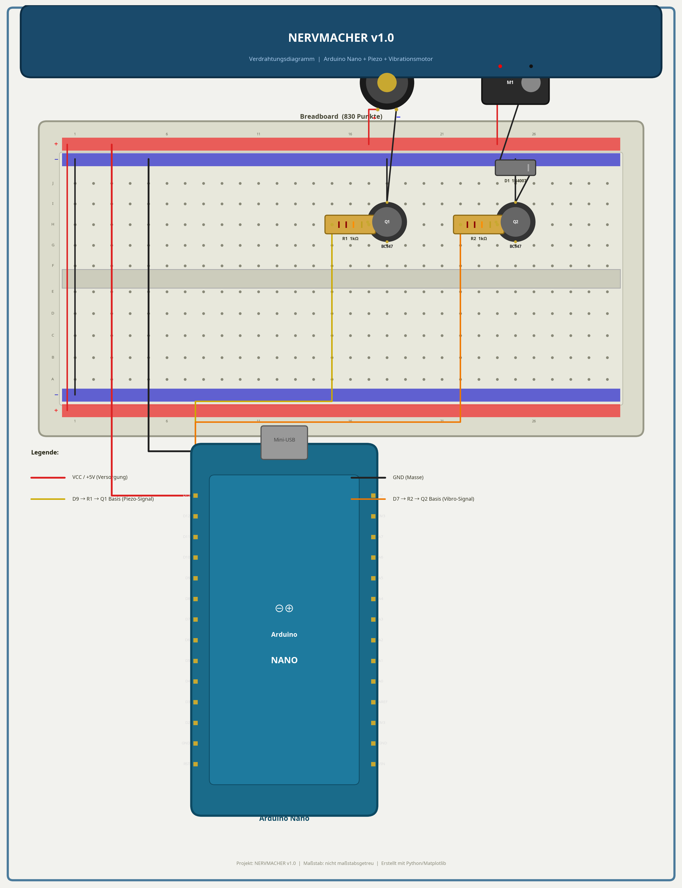
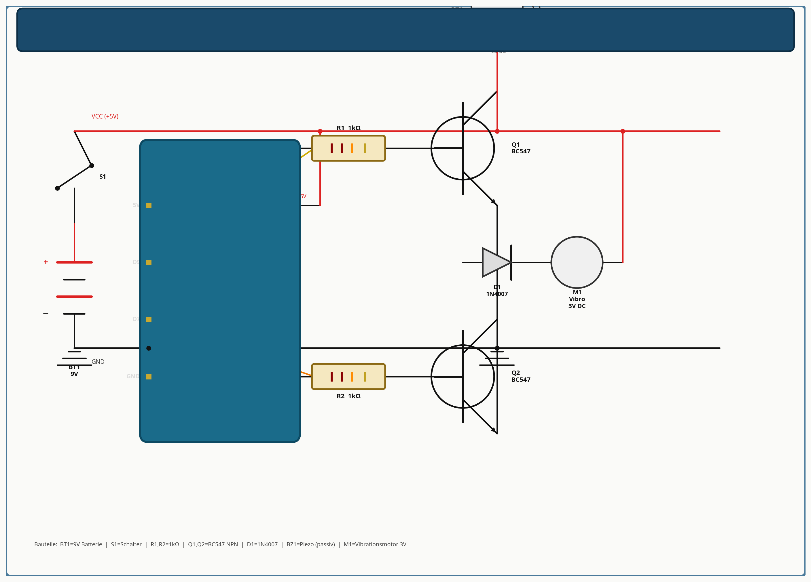

# NERVMACHER v1.0 – Der ultimative Arduino-Störsender

Ein verstecktes Arduino-Projekt, das in zufälligen Intervallen (2 bis 15 Minuten) extrem nervige Geräusche abspielt. Perfekt als Prank (Streich) für Freunde oder Kollegen. Das Gerät erzeugt naturgetreues Grillenzirpen, schrilles Hochton-Piepen und vibriert zusätzlich.

---

## 1. Projektübersicht

| Eigenschaft | Details |
| :--- | :--- |
| **Schwierigkeitsgrad** | Anfänger / Mittel |
| **Zeitaufwand** | ca. 30–45 Minuten |
| **Kosten** | ca. 10–15 € |
| **Mikrocontroller** | Arduino Nano (oder Micro / Uno) |
| **Hauptfunktion** | Zufällige Sound-Wiedergabe (Grille, Piepen) + Vibration |

**Warum dieses Projekt?**
Ein normaler Buzzer am Arduino ist oft zu leise. Dieses Projekt nutzt einen NPN-Transistor (BC547) als Verstärker, um den Piezo-Buzzer direkt mit der 5V-Schiene (oder 9V) zu betreiben. Dadurch wird eine Lautstärke von bis zu 95 dB erreicht – laut genug, um in einem ganzen Raum für Verwirrung zu sorgen.

---

## 2. Bauteilliste (BOM)

| Anzahl | Bauteil | Beschreibung |
| :---: | :--- | :--- |
| 1x | **Arduino Nano** | Das Gehirn des Projekts (klein und leicht zu verstecken). |
| 1x | **Piezo-Buzzer (passiv)** | Wichtig: Passiv! Ein aktiver Buzzer kann keine Grillen-Frequenzen erzeugen. |
| 1x | **Vibrationsmotor** | 3V DC Micro-Vibrationsmotor (z.B. aus einem alten Handy). |
| 2x | **Transistor BC547** | NPN-Transistor zur Stromverstärkung für Buzzer und Motor. |
| 2x | **Widerstand 1 kΩ** | Basis-Vorwiderstand für die Transistoren (Farbcode: Braun-Schwarz-Rot). |
| 1x | **Diode 1N4007** | Freilaufdiode zum Schutz des Arduino vor dem Motor. |
| 1x | **9V Batterie + Clip** | Zur mobilen Stromversorgung. |
| 1x | **Schiebeschalter** | Zum Ein- und Ausschalten des Geräts. |
| 1x | **Breadboard** | Half-Size (400 Punkte) oder Full-Size (830 Punkte) für den Aufbau. |
| div. | **Jumper-Kabel** | Zur Verdrahtung. |

---

## 3. Schaltplan & Verdrahtung

Der Aufbau besteht aus zwei getrennten Verstärker-Schaltkreisen:
1. **Audio-Zweig (Pin D9):** Schaltet den Transistor Q1 sehr schnell ein und aus (PWM), um den Piezo-Buzzer zum Schwingen zu bringen.
2. **Vibro-Zweig (Pin D7):** Schaltet den Transistor Q2 ein, um den Vibrationsmotor zu aktivieren. Die Diode D1 schützt vor Spannungsspitzen beim Abschalten des Motors.

### Verdrahtungsdiagramm (Breadboard)

### Schematischer Schaltplan

---

## 4. Schritt-für-Schritt Aufbauanleitung

1. **Stromversorgung vorbereiten:**
   Verbinde den 5V-Pin des Arduino mit der roten Stromschiene (+) des Breadboards und den GND-Pin mit der blauen Schiene (−).
2. **Audio-Verstärker aufbauen:**
   - Stecke den Transistor Q1 (BC547) auf das Breadboard.
   - Verbinde den Emitter (rechter Pin, wenn flache Seite zu dir zeigt) mit GND.
   - Verbinde die Basis (mittlerer Pin) über den 1kΩ Widerstand (R1) mit Pin D9 des Arduino.
   - Verbinde den Minus-Pol des Piezo-Buzzers mit dem Kollektor (linker Pin) von Q1.
   - Verbinde den Plus-Pol des Piezo-Buzzers mit der 5V-Schiene.
3. **Vibrations-Verstärker aufbauen:**
   - Stecke den Transistor Q2 (BC547) auf das Breadboard.
   - Verbinde den Emitter mit GND.
   - Verbinde die Basis über den 1kΩ Widerstand (R2) mit Pin D7 des Arduino.
   - Stecke die Diode D1 parallel zum Motoranschluss (Ring-Markierung der Diode zeigt zu 5V).
   - Verbinde den Minus-Pol des Motors mit dem Kollektor von Q2.
   - Verbinde den Plus-Pol des Motors mit der 5V-Schiene.
4. **Batterie anschließen:**
   Verbinde den 9V-Batterieclip über den Schalter mit dem VIN-Pin des Arduino (oder direkt an die 5V-Schiene, falls du einen 5V-Spannungsregler verwendest).

---

## 5. Der Code

Der Code nutzt die `tone()`-Funktion für das Piepen und präzises `delayMicroseconds()` für das naturgetreue Grillenzirpen. Der Zufallsgenerator wird über den unverbundenen analogen Pin A0 initialisiert.

Lade die Datei `nervmacher.ino` auf deinen Arduino hoch.

### Funktionsweise des Codes:
- **Zufallsintervalle:** Das Gerät wartet zwischen 2 und 15 Minuten (`INTERVALL_MIN` und `INTERVALL_MAX`).
- **Grillenzirpen:** Eine echte Grille zirpt bei ca. 4,8 kHz in kurzen "Bursts" (ca. 120 Pulse), gefolgt von kurzen Pausen. Der Code simuliert dieses Verhalten exakt.
- **Hochton-Piepen:** Ein extrem schriller Ton bei 4 kHz, der schwer zu orten ist.

---

## 6. Testen & Fehlersuche

- **Es kommt kein Ton:** Überprüfe die Polung des Piezo-Buzzers und stelle sicher, dass du einen *passiven* Buzzer verwendest. Ein aktiver Buzzer macht nur "Klack", wenn man ihn mit PWM ansteuert.
- **Der Ton ist zu leise:** Stelle sicher, dass der Transistor richtig herum eingesteckt ist (Kollektor an Buzzer, Emitter an GND).
- **Der Arduino stürzt ab, wenn der Motor läuft:** Überprüfe, ob die Freilaufdiode (D1) korrekt eingebaut ist. Ohne sie können induktive Spannungsspitzen den Mikrocontroller resetten.

---

## 7. Erweiterungsideen

- **Lichtsensor (LDR):** Füge einen Fotowiderstand hinzu, damit das Gerät nur im Dunkeln zirpt (wie echte Grillen).
- **Bewegungsmelder (PIR):** Das Gerät verstummt sofort, wenn sich jemand nähert, und fängt erst wieder an, wenn die Person weg ist. Das macht es unmöglich, das Gerät zu finden!
- **Sleep-Modus:** Nutze die `LowPower.h` Bibliothek, um den Arduino zwischen den Tönen in den Tiefschlaf zu versetzen. So hält die 9V-Batterie mehrere Wochen.
