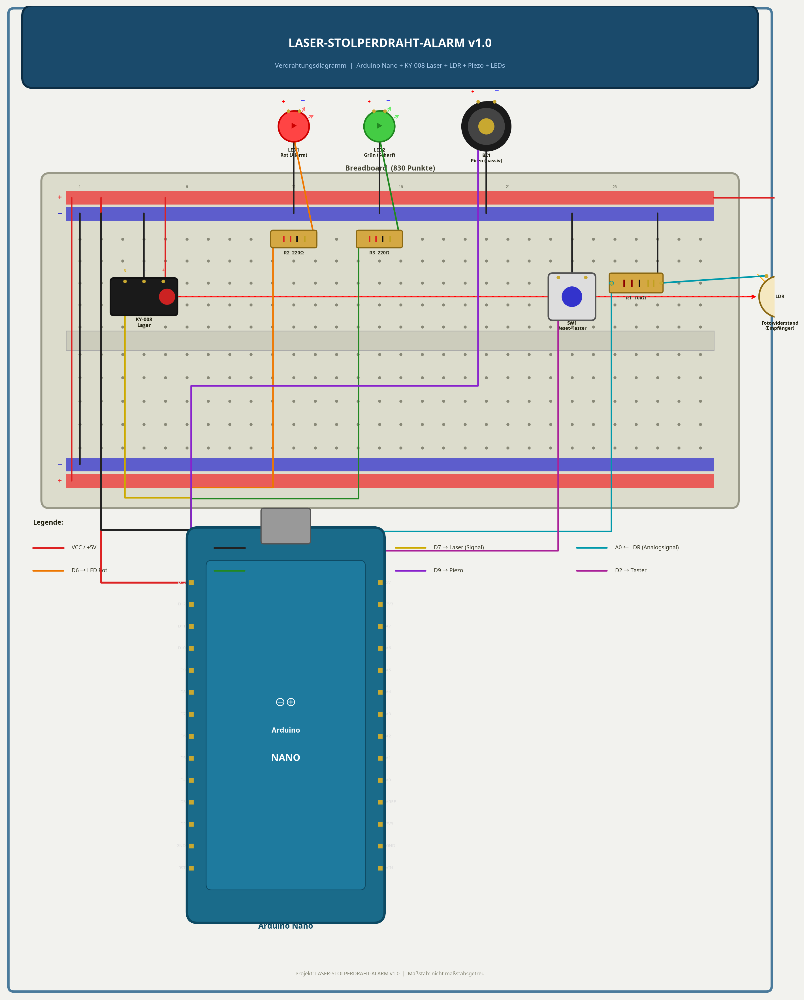
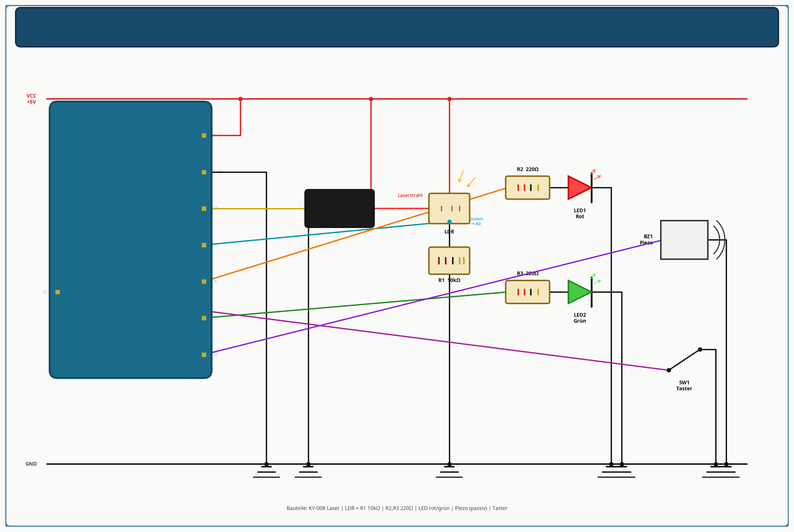

# 🚨 Laser-Stolperdraht-Alarm v1.0

Ein unsichtbarer Laserstrahl überwacht einen Durchgang. Wird der Strahl unterbrochen, löst sofort ein lauter Alarm aus und eine rote LED blinkt. Ideal als Türalarm, Schubladenüberwachung oder einfach als cooles Spionage-Gadget.

---

## 1. Projektübersicht

| Eigenschaft | Details |
| :--- | :--- |
| **Schwierigkeitsgrad** | Anfänger |
| **Zeitaufwand** | ca. 30 Minuten |
| **Kosten** | ca. 5–8 € |
| **Mikrocontroller** | Arduino Nano (oder Micro / Uno) |
| **Hauptfunktion** | Lichtschranke mit automatischer Kalibrierung |

**Besonderheit dieses Projekts:**
Der Code verfügt über eine **automatische Kalibrierung**. Beim Einschalten misst der Arduino für 3 Sekunden die Helligkeit des Lasers auf dem Sensor. Dadurch funktioniert der Alarm bei jedem Umgebungslicht – egal ob im dunklen Keller oder im hellen Wohnzimmer.

---

## 2. Bauteilliste (BOM)

| Anzahl | Bauteil | Beschreibung |
| :---: | :--- | :--- |
| 1x | **Arduino Nano** | Der Mikrocontroller. |
| 1x | **KY-008 Lasermodul** | Sendet einen gebündelten roten Laserstrahl. |
| 1x | **LDR Fotowiderstand** | Der Empfänger (Lichtsensor). |
| 1x | **Piezo-Buzzer (passiv)** | Für die Alarmsirene. |
| 1x | **LED Rot** | Blinkt bei Alarm. |
| 1x | **LED Grün** | Leuchtet, wenn das System "scharf" ist. |
| 1x | **Widerstand 10 kΩ** | Für den Spannungsteiler des LDR. |
| 2x | **Widerstand 220 Ω** | Vorwiderstände für die LEDs. |
| 1x | **Taster (Push-Button)** | Zum Zurücksetzen des Alarms. |
| 1x | **Breadboard & Kabel** | Für den Aufbau. |

---

## 3. Schaltplan & Verdrahtung

Das System besteht aus einem Sender (Laser) und einem Empfänger (LDR). Der LDR bildet zusammen mit dem 10kΩ Widerstand einen Spannungsteiler, dessen Wert vom analogen Pin A0 ausgelesen wird.

### Verdrahtungsdiagramm (Breadboard)

### Schematischer Schaltplan

---

## 4. Schritt-für-Schritt Aufbauanleitung

1. **Stromversorgung:**
   Verbinde den 5V-Pin des Arduino mit der roten Stromschiene (+) und den GND-Pin mit der blauen Schiene (−).
2. **Laser anschließen:**
   - Verbinde den Pin `-` des KY-008 mit GND.
   - Verbinde den Pin `S` (Signal) mit Pin D7 des Arduino.
3. **LDR (Lichtsensor) anschließen:**
   - Stecke den LDR auf das Breadboard.
   - Verbinde ein Bein mit 5V.
   - Verbinde das andere Bein mit Pin A0 des Arduino **UND** über den 10kΩ Widerstand mit GND.
4. **LEDs anschließen:**
   - Verbinde das lange Bein (Anode) der roten LED über einen 220Ω Widerstand mit Pin D6.
   - Verbinde das lange Bein der grünen LED über einen 220Ω Widerstand mit Pin D5.
   - Verbinde die kurzen Beine (Kathoden) beider LEDs mit GND.
5. **Buzzer & Taster:**
   - Verbinde den Plus-Pol des Buzzers mit Pin D9 und den Minus-Pol mit GND.
   - Verbinde ein Bein des Tasters mit Pin D2 und das andere mit GND (wir nutzen den internen Pull-Up-Widerstand des Arduino).

---

## 5. Der Code

Lade die Datei `laser_alarm.ino` auf deinen Arduino hoch.

### So funktioniert die Kalibrierung:
1. Richte den Laserstrahl genau auf den LDR.
2. Schalte den Arduino ein.
3. Die grüne LED blinkt für 3 Sekunden. In dieser Zeit misst der Arduino die Helligkeit.
4. Danach leuchtet die grüne LED dauerhaft: Das System ist **SCHARF**.
5. Wird der Strahl unterbrochen, fällt der gemessene Wert unter den Schwellwert (Standard: 40% Abfall) und der Alarm löst aus.
6. Drücke den Taster, um den Alarm zu stoppen und das System wieder scharf zu schalten.

---

## 6. Testen & Fehlersuche

- **Der Alarm löst sofort aus:** Der Laser trifft den LDR nicht richtig. Richte den Laser exakt aus und drücke den Reset-Knopf am Arduino, um die Kalibrierung neu zu starten.
- **Der Alarm löst nicht aus, wenn ich durchlaufe:** Das Umgebungslicht ist zu hell (der LDR merkt nicht, dass der Laser fehlt). Stecke den LDR in ein kleines Röhrchen (z.B. einen schwarzen Strohhalm), damit nur Licht von vorne (vom Laser) auf ihn fallen kann.
- **Der Buzzer knackt nur:** Du hast einen aktiven Buzzer erwischt. Für die Sirene brauchst du einen *passiven* Piezo-Buzzer.

---

## 7. Erweiterungsideen

- **Spiegel-Parcours:** Nutze kleine Spiegel, um den Laserstrahl im Zickzack durch den ganzen Raum zu lenken, bevor er auf den LDR trifft.
- **SMS-Benachrichtigung:** Ersetze den Arduino Nano durch einen ESP8266 (NodeMCU) und lass dir bei einem Alarm eine Nachricht aufs Handy schicken (z.B. über Telegram oder IFTTT).
